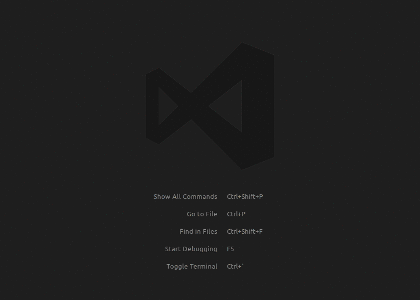
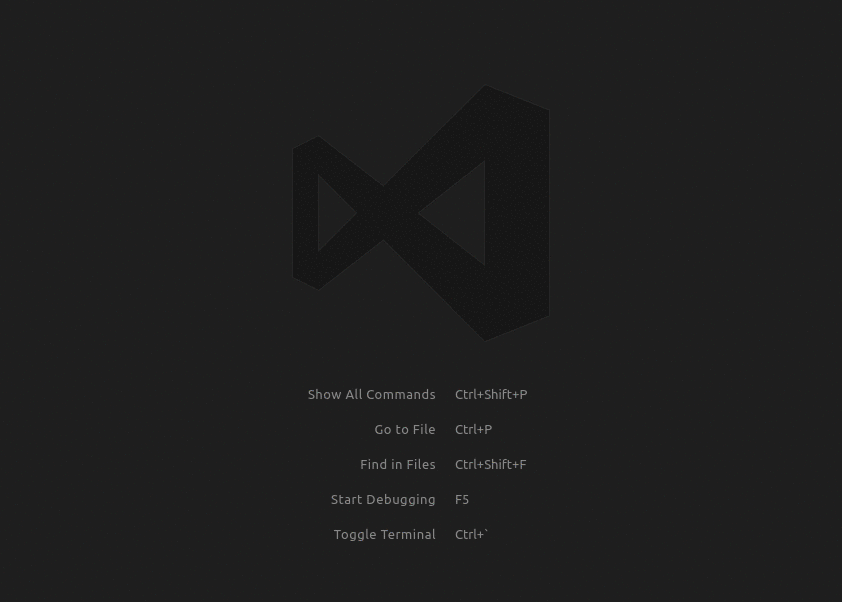

# Laravel Artisan

Run Laravel Artisan commands from within Visual Studio Code.

## Features

* Supports multiple instances of **artisan** in the same workspace hierarchy
* Make files (Controllers, Migrations, Models, etc)
* Run Custom Commands
* Manage the database
* Clear Caches
* Generate Keys
* View all routes
* Start/stop a local php server for test purposes
* Docker support

### Get a list of routes



### Make a controller



## Requirements

**Note:** The `php` setting is optional if the setting `artisan.php.location` is set in your `settings.json` file and points to a valid php executable. If this setting is set, the extension will prefer the setting over the one within the path.

* A useable version of `php` that can be ran on the command line such as `php-cli` (This should be in your path)
    * The following command should yield a php version:
    * `php -v`
        * If no php version is returned you don't have php setup correctly.
        * If you get a version back you are good to go!
* A Laravel install that has `artisan` in the workspace root
    * cd into your root directory and run the following command:
    * `php artisan -v`
        * If an error is returned you don't have laravel setup correctly.
        * If you get a Laravel version and a list of commands you are good to go!

## Usage

Once you have installed the extension, it will become active once you open a workspace that has at least one `artisan` file within the workspace.
You can then open the command pallet, and start running the commands.
Just type `Artisan:` to get a list of commands. If you have more than one `artisan` file within the workspace, then this will ask which `artisan` file you want to use to execute the selected command.

Many commands have optional input questions, leave them blank to use the defaults, or enter your own value.

All commands are accessible through `Artisan: Run Command`, here you can access your custom commands as well as built in commands.

## Docker

If you are running Laravel with Docker you can set config vars like this, considering your `docker-compose.yml` is placed on project's root.

```json
{
  "artisan.docker.enabled": true,
  "artisan.docker.command": "docker-compose exec <app>"
}
```

Where `<app>` is your container name. **Note** this is a base command that will prepend to artisan commands.

Example:

```sh
docker-compose exec app php artisan make:model Post
```

Before running any commands, make sure the containers are running (`docker-compose up`).


## WSL

If php is installed with WSL (Windows Subsystems for Linux), add the path to the executable in `settings.json` like below

* Replace `<username>` with the correct user name
* Replace `CanonicalGroupLimited.Ubuntu18.04onWindows_79rhkp1fndgsc` with the proper package name
* Replace `usr\\bin\\php` if **php** is installed in different location

```json
{
    "artisan.php.location": "C:\\Users\\<username>\\AppData\\Local\\Packages\\CanonicalGroupLimited.Ubuntu18.04onWindows_79rhkp1fndgsc\\LocalState\\rootfs\\usr\\bin\\php"
}
```